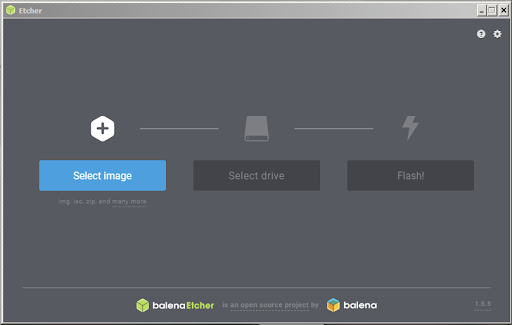

# Setting up your Jetson

## Introduction
The [NVIDIA® Jetson Nano™ Developer Kit](https://developer.nvidia.com/embedded/jetson-nano-developer-kit) is a small AI computer for makers, learners, and developers. After following along with this brief guide, you’ll be ready to start building practical AI applications, cool AI robots, and more.

    

---

## Write Image to the microSD Card

To prepare your microSD card, you’ll need a computer with Internet connection and the ability to read and write SD cards, either via a built-in SD card slot or adapter.

1. **Download the Jetson Nano SD Card Image:**
   - [Jetson Nano Developer Kit SD Card Image](https://developer.nvidia.com/jetson-nano-sd-card-image)
   - Note the location where it was saved.

2. **Format your microSD card using SD Card Formatter:**
   - Tool: [SD Memory Card Formatter](https://www.sdcard.org/downloads/formatter/eula_windows/)
   - Steps:
     - Select card drive
     - Select “Quick format”
     - Leave “Volume label” blank
     - Click “Format”, then “Yes” on the warning dialog

    

3. **Write the image using Etcher:**
   - Tool: [Etcher](https://www.balena.io/etcher)
   - Instructions:
     - Click “Select image” and choose the zipped image file
     - Insert microSD card if not already
     - Click “Select drive” and choose correct device
     - Click “Flash!”
     - Wait ~10 minutes for flashing and validation

    

    

    

> After flashing, Windows may show an error about reading the SD Card. Just click Cancel and remove it.

---

## Boot your Jetson

1. **Insert the microSD card** (with image flashed) into the slot on the underside of the Jetson Nano module.

    

2. **Connect peripherals:**
   - Mouse, keyboard
   - Monitor (HDMI or DisplayPort)
   - Ethernet cable for internet access

    

3. **Power up:**
   - Use Micro-USB or 5V/4A DC barrel jack (J25 connector)
   - Jetson Nano will power on and boot automatically

---

## Initial Setup
   

    

   Follow the on-screen instructions for the initial setup, which includes:

   - Setting your language and region.
   

    

   - Connecting to a Wi-Fi network (if applicable).

   - Creating a username and password.
   

    

   - Completing the NVIDIA Jetson setup wizard.

    

   This process might take a few minutes.
