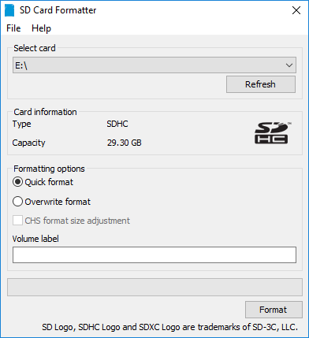
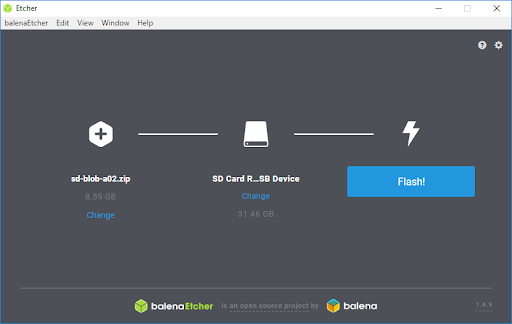

# Setting up your Jetson


## Introduction
The [NVIDIA® Jetson Nano™ Developer Kit](https://developer.nvidia.com/embedded/jetson-nano-developer-kit) is a small AI computer for makers, learners, and developers. After following along with this brief guide, you’ll be ready to start building practical AI applications, cool AI robots, and more.

<div align='center'>
    
</div>

---

## Write Image to the microSD Card

To prepare your microSD card, you’ll need a computer with Internet connection and the ability to read and write SD cards, either via a built-in SD card slot or adapter.

1. **Download the Jetson Nano SD Card Image:**
   - [Jetson Nano Developer Kit SD Card Image](https://developer.nvidia.com/jetson-nano-sd-card-image)
   - Note the location where it was saved.

2. **Format your microSD card using SD Card Formatter:**
   - Tool: [SD Memory Card Formatter](https://www.sdcard.org/downloads/formatter/eula_windows/)
   - Steps:
     - Select card drive
     - Select “Quick format”
     - Leave “Volume label” blank
     - Click “Format”, then “Yes” on the warning dialog

<div align='center'>
    
</div>

3. **Write the image using Etcher:**
   - Tool: [Etcher](https://www.balena.io/etcher)
   - Instructions:
     - Click “Select image” and choose the zipped image file
     - Insert microSD card if not already
     - Click “Select drive” and choose correct device
     - Click “Flash!”
     - Wait ~10 minutes for flashing and validation

<div align='center'>
    
</div>

<div align='center'>
    
</div>

<div align='center'>
    
</div>

> After flashing, Windows may show an error about reading the SD Card. Just click Cancel and remove it.

---

## Boot your Jetson

1. **Insert the microSD card** (with image flashed) into the slot on the underside of the Jetson Nano module.

<div align='center'>
    
</div>

2. **Connect peripherals:**
   - Mouse, keyboard
   - Monitor (HDMI or DisplayPort)
   - Ethernet cable for internet access

<div align='center'>
    
</div>

3. **Power up:**
   - Use Micro-USB or 5V/4A DC barrel jack (J25 connector)
   - Jetson Nano will power on and boot automatically

---

## Initial Setup
   <div align='center'>
    
</div>
   Follow the on-screen instructions for the initial setup, which includes:

   - Setting your language and region.
   <div align='center'>
    
</div>

   - Connecting to a Wi-Fi network (if applicable).

   - Creating a username and password.
   <div align='center'>
    
</div>
   - Completing the NVIDIA Jetson setup wizard.

<div align='center'>
    
</div>
   This process might take a few minutes.

##  Access the Terminal

Once you've completed the initial setup, you will be presented with the Ubuntu desktop.  
- **Open the Terminal** by clicking the terminal icon or by pressing `Ctrl + Alt + T`.

## Essential Tools Installation

### 1. Update and Upgrade System
Open a terminal and run:

```bash
sudo apt update && sudo apt upgrade -y
```

This ensures your system packages are up to date.

---

### 2. Install `jetson-utils` and `jetson-inference`

```bash
git clone --recursive https://github.com/dusty-nv/jetson-inference
cd jetson-inference
mkdir build
cd build
cmake ../
make -j$(nproc)
sudo make install
sudo ldconfig
```

### Jetson-utils and Jetson-inference Version Check

This guide will help you verify if the `jetson-utils` and `jetson-inference` libraries are installed correctly on your Jetson device.

### Verify `jetson-utils` Installation

To confirm that `jetson-utils` is properly installed, run the following command in your terminal:

```bash
python3 -c "import jetson.utils; print(jetson.utils.__version__)"
```

---

### 3. Install `jtop` (System Monitor for Jetson)

```bash
sudo apt install -y python3-pip
sudo pip3 install -U jetson-stats
```

To run `jtop`:
```bash
jtop
```

<div align='center'>
    
</div>

---

# 4. Installing OpenCV 4.11.0 on Jetson Nano (with Enlarged Swap Memory)

Installing OpenCV on Jetson Nano requires more RAM than available by default. This guide expands swap memory using your SD card and installs OpenCV via a script.

---
<div align='center'>
    
</div>

---
##  Step 1: Update & Install Tools

Start with a clean update and install tools.

```bash
sudo apt-get update
sudo apt-get upgrade
sudo apt-get install nano
sudo apt-get install dphys-swapfile
$ sudo nano /sbin/dphys-swapfile
# give the required memory size
$ sudo nano /etc/dphys-swapfile
# reboot afterwards
$ sudo reboot
```
---
<div align='center'>
    
</div>

---
# OpenCV 4.11.0 Installation Script for Jetson Nano
---
<div align='center'>
    
</div>


```bash
$ free -m
# you need at least a total of 8.5 GB!
$ wget https://github.com/Qengineering/Install-OpenCV-Jetson-Nano/raw/main/OpenCV-4-11-0.sh
$ sudo chmod 755 ./OpenCV-4-11-0.sh
$ ./OpenCV-4-11-0.sh
# once the installation is done...
$ rm OpenCV-4-11-0.sh
# remove the dphys-swapfile now
$ sudo /etc/init.d/dphys-swapfile stop
$ sudo apt-get remove --purge dphys-swapfile
# just a tip to save an additional 275 MB
$ sudo rm -rf ~/opencv
$ sudo rm -rf ~/opencv_contrib
```


The whole installation will take 2-3 hours to complete.

```bash
python3 -c "import cv2; print("OpenCV version:", cv2.__version__)"
OpenCV version: 4.11.0
```

OpenCV version: 4.11.0
---
<div align='center'>
    
</div>

